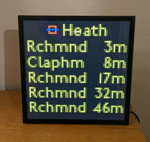
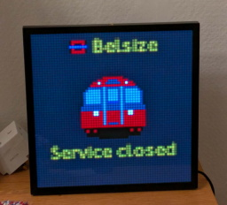

# Transport for London - Pixoo 64

A Real-Time TfL Departures Board for Pixoo64

<table style="width: 100%;">
  <tr>
    <td>
      
    </td>
    <td>
      
    </td>
  </tr>
</table>

# Setup

### Shopping

Buy a Pixoo64 from the Divoom website.

If you use my invite link, https://divoominternationa.refr.cc/default/u/peterbatchelor?s=sp&t=cp, then you'll get 12% off.

### TFL API

We are going to get live transport data (tube/overground) from the TFL API.
It can be used without an API key, 
but the responses are more reliable with one.

1) Request an API key from the TFL website (https://api-portal.tfl.gov.uk/signup). 
2) Export the key with `export TFL_APP_KEY=<TFL_APP_KEY>`
3) Test that the key is working by running `cd local && python tfl.py`. 

### Pixoo64 API
The Pixoo64 has 2 APIs, 
a local API and a cloud API, 
but the cloud API is buggy and undocumented.

To avoid running a server 24/7 on our local network,
we set up port forwarding on our router,
so that we can call the local API from outside the Pixoo's network.

In theory this means that if someone knows our public IP + port they can interact with the Pixoo64.
which is only a mild security risk.

1) Ask your favourite LLM how to set up port forwarding.
2) Export the pixoo url with `export PIXOO_URL=http://<PUBLIC_IP>:<PIXOO_PORT>/post`.

### Infrastructure

We'll be using AWS for our infrastructure, which consists of:
* A CloudWatch rule
* Serverless functions (AWS Lambda)
* A queue (AWS SQS)

Once per minute, 
a CloudWatch rule will trigger the producer Lambda,
which will then send jobs to the SQS queue (with set delays).

I.e. It might send 4 jobs, with delays 0, 15, 30 and 45 seconds.

When a job joins the SQS queue,
the consumer Lambda will fire,
read the job description,
design a frame,
and send it to the Pixoo64.

Each Lambda function only runs for ~300ms,
so the cost is ~20p per month. 

Using a persistent server to send requests, 
like a `t4g.nano`,
would cost ~£5 per month.

1) Install the AWS CLI (https://docs.aws.amazon.com/cli/latest/userguide/getting-started-install.html)
2) Install npm (https://nodejs.org)
3) Install Docker (https://www.docker.com/products/docker-desktop/)
4) Install AWS CDK with `npm install -g aws-cdk`
5) Start Docker (you'll need this to build the environment for the AWS Lambda)
6) Go into the AWS folder with `cd aws`
7) Run `aws configure` to set your credentials
8) If it's your first time using AWS CDK, run `cdk bootstrap` to create the CDK toolkit stack.
9) Run `cdk diff` to see what infrastructure will be built.
10) Build your infrastructure with `cdk deploy`.

# Questions

If you need any help setting up this project, please post in the Issues tab.

